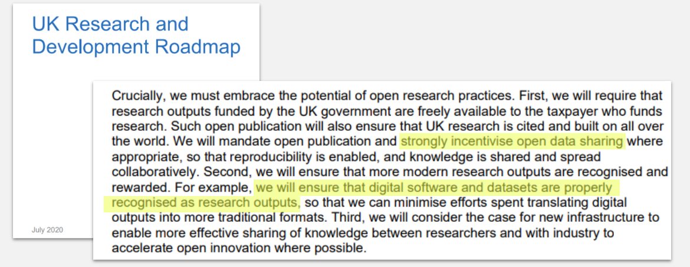

%Software Licensing
%Robert Turner, many others
%September, 2022

# Thanks!
Thanks for coming, thanks to the conference organisers, thanks to ...

# Introductions

- Bob Turner (chair / host)
- ...

# Copyright

::: incremental

- Copyright is a type of intellectual property, particularly relevant to software.
- [Berne Convention](https://en.wikipedia.org/wiki/Berne_Convention) of 1886: Copyright is immediately bestowed upon a work the moment it is created, without requiring any registration.

:::

# Who owns the copyright on my code?

If you're UK researcher, probably **not** you! e.g. University of Sheffield:

::: incremental

- Staff or research students - usually the university ([student IP](https://www.sheffield.ac.uk/research-services/commercialisation/student-ip), [UK gov](https://www.legislation.gov.uk/ukpga/1988/48/section/11).)
- Different rules for undergrads.
- Funded research can have specific agreements in place - check with your PI, or your funding agreements.

:::

# License

::: incremental

- Gives right to use copyright material in specific ways, without changing ownership.
- No license : no **right** to copy.

:::

# UK National Policy

[From the UK R&D Roadmap](https://www.gov.uk/government/publications/uk-research-and-development-roadmap), [OGL 3](https://www.nationalarchives.gov.uk/doc/open-government-licence/version/3/)

# Types of open source license

:::::::::::::: {.columns}
::: {.column width="50%"}
**"Copyleft"** e.g. [GPL3](https://choosealicense.com/licenses/gpl-3.0/)
:::
::: {.column width="50%"}
**More permissive** e.g. [MIT](https://choosealicense.com/licenses/mit/)
:::
::::::::::::::

[choosealicence.com](https://choosealicense.com/)

# Creative Commons?

::: incremental

- Not recommended:
  - Lack of disclaimer
  - Lack software specific terms
  - License compatibility problems

:::

[Adapted from CC FAQ](https://creativecommons.org/faq/#can-i-apply-a-creative-commons-license-to-software)

# Questions for panel...

# Should RSEs advise a default open source licence? Which would it be?

# Should the organisations we work for or study at grant us ownership of the code we produce to licence as we chose?

# How can we make good decisions on whether code should remain closed source for commercial reasons?

# Is it a good idea for research funders to advise or stipluate a particular licence?

# How do we ensure copyright and licensing are correctly managed for projects where people from multiple organisations contribute code?

# How do we avoid useful code languishing on researchers and RSEs laptops when it could be doing something useful for the world via a licence?
